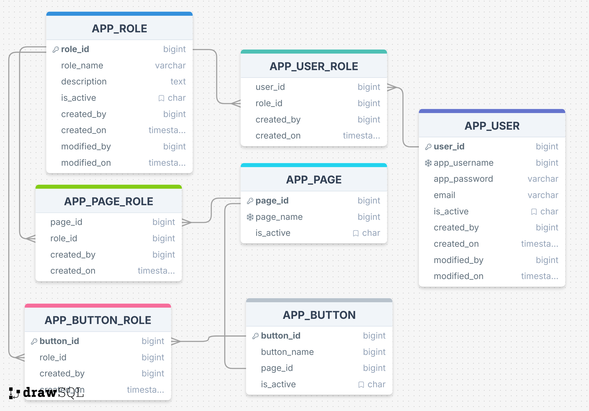

# Roles-Management


This project is a backend application developed using the Spring Boot framework to provide a robust and detailed system for role-based access control (RBAC). It goes beyond simple role management by allowing fine-grained control over permissions, associating roles with specific UI pages and buttons. The system exposes a set of RESTful endpoints to manage roles, their associated permissions (pages/buttons), and user assignments.

## Key Features

*   **Advanced Role Management**: Full CRUD functionality for application roles.
*   **Permission Management**: Ability to associate roles with specific application pages and buttons, enabling fine-grained access control.
*   **User Assignment**: Assign and unassign users to roles.
*   **Transactional Updates**: A dedicated endpoint (`/roles/{id}/details`) to save a role's information and all its associated pages, buttons, and users in a single, atomic transaction.
*   **Detailed Views**: Endpoints to fetch comprehensive details for a role, including all assigned pages, buttons, and users.
*   **Layered Architecture**: Follows a standard Controller-Service-Repository pattern for separation of concerns and maintainability.
*   **Data Transfer Objects (DTOs)**: Utilizes DTOs and mappers to decouple the API layer from the data model.
*   **JPA/Hibernate**: Leverages Spring Data JPA for simplified data access and persistence.
*   **Email Notifications**: Asynchronous email sending capability is enabled (e.g., for user notifications).
*   **Docker Support**: Includes a `docker-compose.yml` for easy setup of the MySQL database.

## Technology Stack

*   **Java 21**: Core programming language.
*   **Spring Boot 3**: Framework for building the application.
*   **Spring Data JPA**: For data persistence with JPA/Hibernate.
*   **Maven**: Dependency Management.
*   **MySQL**: Relational Database.
*   **Lombok**: To reduce boilerplate code.
*   **Docker**: For containerizing the database.

## Getting Started

To get a local copy up and running, follow these simple steps.

### Prerequisites

*   JDK 21 or later
*   Maven
*   Docker (Recommended for database setup)

### Installation & Setup

1.  **Clone the repository:**
    ```sh
    git clone https://github.com/Seif-Mustafa/RolesManagement.git
    ```

2.  **Navigate to the project directory:**
    ```sh
    cd RolesManagement
    ```

3.  **Set up the Database:**

    You have two options for setting up the MySQL database.

    **Option 1: Using Docker (Recommended)**

    This is the easiest way to get the database running. Make sure you have Docker installed and running on your machine.

    From the root of the project directory, run:
    ```sh
    docker-compose up -d
    ```
    This will start a MySQL container with all the necessary configurations. The database will be accessible on port `3307`. The `application.properties` file is already configured to connect to this instance.

    **Option 2: Manual MySQL Setup**

    If you prefer to use a local or remote MySQL instance, ensure it is running and then update `src/main/resources/application.properties` with your database connection details:
    ```properties
    spring.datasource.url=jdbc:mysql://YOUR_HOST:YOUR_PORT/YOUR_DATABASE
    spring.datasource.username=YOUR_USERNAME
    spring.datasource.password=YOUR_PASSWORD
    ```

4.  **Run the application:**

    You can run the application using the Maven Spring Boot plugin:
    ```sh
    ./mvnw spring-boot:run
    ```
    The application will start on the default port `8080` with the context path `/api`.

## API Endpoints

The base URL for the API is `http://localhost:8080/api`.

### Roles Management

| Method | Endpoint                | Description                                                               |
| :----- | :---------------------- | :------------------------------------------------------------------------ |
| `GET`  | `/roles`                | Get all roles                                                             |
| `POST` | `/roles`                | Create a new role                                                         |
| `GET`  | `/roles/{id}`           | Get a role by its ID                                                      |
| `PUT`  | `/roles/{id}`           | Update an existing role's basic details                                   |
| `DELETE`| `/roles/{id}`           | Delete a role by its ID                                                   |
| `GET`  | `/roles/{id}/details`   | Get comprehensive details of a role (including pages, buttons, and users) |
| `POST` | `/roles/{id}/details`   | Save all details for a role (info, pages, buttons, users) transactionally |

*(Note: User management endpoints are part of the overall design but are not detailed here. The focus is on the core role and permission management.)*

## Database Schema

*(This is a placeholder for you to add your schema image. You can drag and drop the image into the GitHub editor, or use a markdown image link.)*


